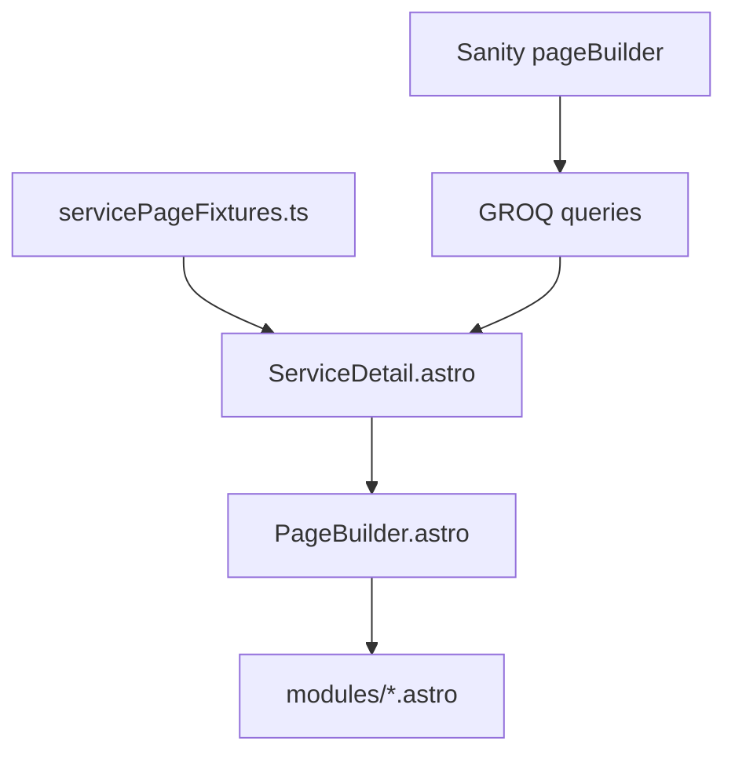

# Guía de contexto para agentes — Growth Lab

Documento de referencia para conversaciones con Cursor/IA. Adjúntalo al inicio de chats nuevos:

```
@docs/AGENT_CONTEXT.md
```

Complementa (no reemplaza) [`.cursor/rules/growth-lab.mdc`](../.cursor/rules/growth-lab.mdc) y [`docs/EDITOR.md`](./EDITOR.md).

---

## 1. Cómo usar este archivo

- **Chat nuevo:** adjunta `@docs/AGENT_CONTEXT.md` + describe la tarea concreta.
- **Tareas Figma:** adjunta también el link/nodo de Figma (ej. `node-id=1-2535`).
- **Planes:** viven en `.cursor/plans/` como referencia histórica — **no editarlos** salvo que el usuario lo pida.
- **Commits:** solo cuando el usuario lo solicite explícitamente.

---

## 2. Stack y repos

| Parte | Ruta | Tech |
|-------|------|------|
| Frontend | `frontend/` | Astro SSR, Tailwind, Vercel adapter |
| CMS | `studio/` | Sanity Studio standalone |
| i18n | `es` (default), `en` | Rutas en `frontend/src/i18n/routes.ts` |

**Requisitos:** Node 22+ (`nvm use`).

**Comandos útiles:**

```bash
npm run dev      # frontend :4321 + studio :3333
npm run check    # astro check + tsc
npm run build    # build producción
npm run typegen  # Sanity TypeGen
```

**Datos en dev:** sin Sanity configurado → fixtures locales. Con CMS y `pageBuilder` publicado → CMS override en runtime.

---

## 3. Arquitectura de imports (obligatorio)

```
pages / views  →  modules / layouts  →  components/ui | components/cards
```

**Nunca invertir** esta dirección.

| Capa | Ubicación | Rol |
|------|-----------|-----|
| Pages | `frontend/src/pages/` | Routing Astro (`[locale]/[...path].astro`) |
| Views | `frontend/src/views/` | Orquestación por tipo de página |
| Modules | `frontend/src/modules/` | Secciones Page Builder (1 Sanity object = 1 módulo) |
| UI | `frontend/src/components/ui/` | Primitivos reutilizables |
| Cards | `frontend/src/components/cards/` | Tarjetas compartidas |
| GROQ | `frontend/src/lib/sanity/queries/` | Queries con `defineQuery` |
| Fragments | `frontend/src/lib/sanity/fragments.ts` | Proyecciones GROQ compartidas |

**`PageBuilder.astro`** es el único switch que mapea `_type` de Sanity → módulo Astro.

---

## 4. Flujo de datos



**Archivos clave:**

- Tipos: `frontend/src/modules/fixtures.ts` — union `PageSection`
- Fixtures dev servicios: `frontend/src/modules/servicePageFixtures.ts`
- Vista detalle servicio: `frontend/src/views/ServiceDetail.astro`
  - Carga fixtures por slug
  - Si CMS devuelve `pageBuilder[]` → reemplaza fixtures
  - Sin slug en `SERVICE_SLUGS` → 404

**Home y otras páginas:** patrón similar con `homeFixtures()` / queries por documento.

---

## 5. Patrón sección Sanity ↔ Astro

**Regla central:** 1 objeto Sanity = 1 renderer en `modules/`. Variantes visuales = prop `layout` o `variant`, **no** componentes duplicados por layout.

Subcomponentes internos del módulo sí están permitidos (ej. `ProcessCard.astro`, `ServiceIncludesPanel.astro`).

### Secciones registradas en pageBuilder

| `_type` Sanity | Módulo Astro |
|--------------|--------------|
| `hero` | `modules/hero/` |
| `logoMarquee` | `modules/logo-marquee/` |
| `metrics` | `modules/metrics/` |
| `serviceSplit` | `modules/service-split/` |
| `methodSteps` | `modules/method-steps/` |
| `caseCards` | `modules/case-cards/` |
| `insightCards` | `modules/insight-cards/` |
| `faqSection` | `modules/faq/` |
| `ctaBanner` | `modules/cta-banner/` |
| `contactFormSection` | `modules/contact-form/` |
| `narrativeCards` | `modules/narrative-cards/` |
| `contentCards` | `modules/content-cards/` |
| `splitStatement` | `modules/split-statement/` |
| `serviceCatalog` | `modules/service-catalog/` |
| `processCards` | `modules/process-cards/` |
| `serviceIncludes` | `modules/service-includes/` |
| `relatedServices` | `modules/related-services/` |

### Variantes con `layout` (ejemplos actuales)

**processCards** (`studio/.../processCards.ts`):

| Layout | Pasos | Uso |
|--------|-------|-----|
| `accordionRow` | 3 | Fila acordeón (Clima) |
| `accordionColumns` | 4 | 3 columnas acordeón (Cultura, Potencial) |
| `accordionSplit` | 4 | Split 2 cols acordeón (Gestión) |
| `dualPaths` | 2 | 2 tarjetas iguales con icono (Liderazgo) |
| `threeMixed` | 2–4 | Legacy |

**serviceIncludes** (`studio/.../serviceIncludes.ts`):

| Layout | Estructura |
|--------|------------|
| `dualColumns` | 2 paneles bordered (teal + magenta), sin foto |
| `splitImage` | Panel teal + imagen a la derecha |

**hero:** variant `servicePage` para detalle de servicio (548px, eyebrow, 2 CTAs).

**faqSection:** variant `roomy` en páginas de servicio.

---

## 6. Plantilla detalle de servicio

Una sola plantilla configurable vía `pageBuilder`. Orden típico (8 secciones):

1. `hero` — variant `servicePage`, header overlay
2. `splitStatement`
3. `processCards`
4. `serviceIncludes`
5. `caseCards` — variant `featured`
6. `relatedServices`
7. `ctaBanner` — variant `services`
8. `faqSection` — variant `roomy`

### Servicios con fixtures (preview dev)

Definidos en `SERVICE_SLUGS` (`servicePageFixtures.ts`):

| Key | Slug ES | ProcessCards | ServiceIncludes |
|-----|---------|--------------|---------------|
| clima | `clima-organizacional` | `accordionRow` | `dualColumns` |
| cultura | `cultura-organizacional` | `accordionColumns` | `splitImage` |
| gestion | `gestion-del-desempeno` | `accordionSplit` | `splitImage` |
| potencial | `potencial-y-mapeo-de-talento` | `accordionColumns` | `splitImage` |
| liderazgo | `liderazgo-y-coaching` | `dualPaths` | `splitImage` |

**URLs dev de referencia:**

- `/es/servicios/clima-organizacional`
- `/es/servicios/cultura-organizacional`
- `/es/servicios/gestion-del-desempeno`
- `/es/servicios/potencial-y-mapeo-de-talento`
- `/es/servicios/liderazgo-y-coaching`

Asignar layouts distintos por servicio en fixtures permite **comparar variantes Figma** sin duplicar páginas.

---

## 7. i18n

- Rutas traducidas: `frontend/src/i18n/routes.ts`
- Helper: `getLocalizedPath(locale, key, slug?)`
- Fixtures: contenido ES/EN con ternary `isEn ? '...' : '...'`
- Sanity: documentos por idioma; usar selector de traducción en Studio
- Slug EN distinto al ES (ej. `organizational-climate` vs `clima-organizacional`)

---

## 8. Interactividad (islands)

**`client:*` solo para:**

- Nav móvil
- FAQ accordion (formulario de contacto también)

**Acordeones sin island:** `<script>` inline en el módulo (patrón `Faq.astro`, usado en `ProcessCards.astro`).

No añadir React/Vue islands para animaciones que se resuelven con CSS + script mínimo.

---

## 9. Workflow Figma → código

1. Identificar **nodo específico** del frame (no toda la página si basta el componente).
2. `get_design_context` vía Figma MCP (cargar skill design-to-code primero).
3. Exportar assets a `frontend/public/assets/figma/{area}/` (SVG checks, decor, fotos).
4. Adaptar a Tailwind existente — **no** instalar UI kits ni temas Astro de terceros.
5. Schema Sanity: añadir `layout` + validaciones (ej. pasos requeridos por layout).
6. Extender `PageSection` en `fixtures.ts` + case en `PageBuilder.astro`.
7. Asignar layout en `servicePageFixtures.ts` para preview en dev.
8. Verificar: URLs dev, `npm run check`, `npm run build`, mobile (stack vertical).

### Design tokens Figma recurrentes

**ProcessCards — tones por índice de paso:**

| Index | Color | Texto |
|-------|-------|-------|
| 0 | teal `#054e58` | white |
| 1 | magenta `#8b1758` | white |
| 2 | cream `#ffeca7` | `#150e0e` |
| 3 | navy `#051a3b` | white |

Excepción: `accordionSplit` usa orden `teal → navy → magenta → cream`.

**ServiceIncludes — paneles:**

- Borde teal `#054e58` / magenta `#8b1758`
- Título 24px uppercase; items 16px `white/75`
- Checks: `public/assets/figma/services/includes/check-teal.svg`, `check-magenta.svg`

**ProcessCards assets:** `public/assets/figma/services/process/` (icon-plus/minus, card-decor, path-icons).

---

## 10. Checklist: añadir sección nueva

1. Object schema → `studio/src/schemaTypes/objects/{nombre}.ts`
2. Registrar en `studio/src/schemaTypes/objects/pageBuilder.ts`
3. Export en `studio/src/schemaTypes/index.ts`
4. Tipo en `frontend/src/modules/fixtures.ts` (`PageSection` union)
5. Case en `frontend/src/components/PageBuilder.astro`
6. Módulo renderer → `frontend/src/modules/{nombre}/`
7. GROQ: spread `...` en `pageBuilderProjection` suele bastar; proyección explícita solo si hay refs anidadas especiales
8. Fixture de ejemplo en `servicePageFixtures.ts` o página correspondiente

---

## 11. Skills a consultar según tarea

| Tarea | Skill |
|-------|-------|
| Schemas, GROQ, TypeGen, Visual Editing | `@sanity-best-practices` |
| Render Portable Text | `@portable-text-serialization` |
| Migración desde otro CMS | `@sanity-migration` |
| SEO, hreflang, JSON-LD | `@seo-aeo-best-practices` |
| Figma MCP | skill `figma-design-to-code` antes de `get_design_context` |
| Modelado de contenido | `@content-modeling-best-practices` |

---

## 12. Calidad y scope

- **Diff mínimo** — no refactorizar fuera del scope pedido.
- **No commit** salvo solicitud explícita del usuario.
- **No añadir:** dependencias no usadas, Storybook, abstracciones prematuras, UI kits genéricos.
- **No editar** archivos `.plan.md` del usuario.
- **Verificar** frontend: `npm run check` + `npm run build` antes de cerrar tareas.
- **Convención imports:** `pages → modules → components` (nunca al revés).
- **Una sección Sanity = un módulo**; layouts son props, no copias del componente.

---

## 13. Assets y placeholders

```
frontend/public/assets/figma/
├── home/           # checks FAQ, chevrons, social
├── services/
│   ├── includes/   # check-teal/magenta, includes-cultura.webp
│   ├── process/    # acordeón ProcessCards
│   └── hero.webp, includes-placeholder.webp
└── recruitment/
```

Imágenes Sanity: `urlFor()` en módulos cuando `image` es objeto CMS, string path cuando viene de fixtures.

---

## 14. Links internos

| Doc | Para qué |
|-----|----------|
| [README.md](../README.md) | Setup, scripts, arquitectura breve |
| [docs/EDITOR.md](./EDITOR.md) | Guía editorial Sanity (contenido, no código) |
| [.cursor/rules/growth-lab.mdc](../.cursor/rules/growth-lab.mdc) | Reglas always-on en Cursor |

---

## 15. Decisiones de producto ya tomadas

- **Una plantilla de servicio** con variaciones por sección (layout en Sanity), no páginas duplicadas por servicio.
- **Potencial** mantiene `accordionColumns`; **Liderazgo** usa `dualPaths` para comparar layouts ProcessCards.
- **Clima** usa `dualColumns` en ServiceIncludes; **Cultura** usa `splitImage` con foto real.
- Header en detalle servicio: `headerAppearance="overlay"`.
- Locales: ES default; paths estáticos traducidos vía `i18n/routes.ts`.

Actualiza esta sección cuando se tomen decisiones arquitectónicas nuevas en conversaciones.
